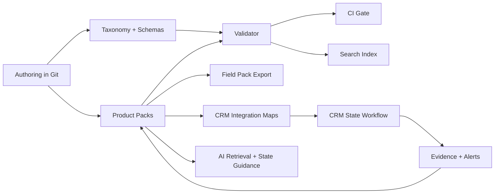
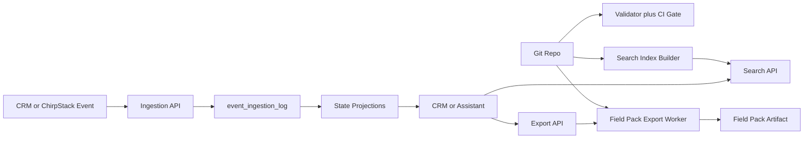

# DPL Architecture

## Context
The Digital Product Library is the source-of-truth for CRM state transitions, field execution, and deterministic AI guidance.

## Data Flow

## Phase 1 MVP Runtime
The phase-1 MVP keeps the runtime surface deliberately small:
- ingest contract-valid CRM, ChirpStack, and lifecycle events
- expose deterministic search over the generated library index
- queue field-pack exports from repository content
- keep AI behavior retrieval-only and outside the backend write path

## Phase 1 Service Boundaries
- Ingestion API validates all inbound events against `schemas/crm-event.schema.json` and returns deterministic failures via `schemas/error-envelope.schema.json`.
- Search API reads `.index/library_index.json` generated from product-pack content and returns ranked metadata only.
- Export API queues asynchronous field-pack generation using `tools/export_field_pack.py`; it returns job state and artifact metadata, not direct business logic.
- State projections are materialized views for CRM/support read paths; the immutable event ledger remains the audit source.
- Product packs, schemas, and taxonomy files remain authoritative in Git. Runtime services consume generated artifacts and mappings; they do not redefine contract data.

## Phase 2 Thin-Slice Pilot Overlay
- Pilot plan source: `docs/backend-thin-slice-pilot-plan.md`.
- Cutover policy:
  - run ingestion and projection in shadow mode before CRM read-path cutover
  - require projection parity checks for gateway and edge-node pilot projects
  - gate cutover by explicit board go/no-go review with rollback rehearsal
- Rollback policy:
  - pause projection workers and revert CRM reads if projection lag or parity fails
  - route export requests to manual fallback tooling when queue SLA is not met
  - retain immutable ingestion ledger for replay and forensic analysis

## Component Notes
- `states.yaml` is the canonical state order; CRM mapping must remain one-to-one.
- Product pack state folders hold execution artifacts (`statepack`, checklist, validations, SOP).
- Validator blocks drift between taxonomy/schemas and product content.
- Nextcloud artifacts are referenced by immutable IDs and hashes in `integrations/nextcloud/artifact-index.yaml`.

## Dependencies
- Python tooling in `tools/` with dependencies from `tools/requirements.txt`
- JSON Schemas in `schemas/`
- CRM integration mapping files in `integrations/crm/`

## Phase-2 Documentation Operations
- Launch gate is driven by `docs/runbooks/docs-launch-gate.md` and must pass before release approval.
- `docs-core` runs a weekly cross-cutting consistency sweep across:
  - `README.md`
  - `CONTRIBUTING.md`
  - `docs/architecture.md`
- Product maintainers must add release-note entries per affected product with artifact/checksum references from `integrations/nextcloud/artifact-index.yaml`.
- Onboarding readiness is verified through a timed dry run in `docs/runbooks/onboarding-dry-run.md`; target duration is under 30 minutes.

## Operational Assumptions
- Contributors run validation before each PR.
- CRM implements state IDs exactly as defined in `states.yaml`.
- Artifact hashes are updated from placeholder values before production reliance.
- MVP backend deployments are blocked on validator, CRM contract, and end-to-end smoke-test success.
- Launch-gate CI required checks are enforced independently (`validator`, `fixtures`, `index-build`, `export-smoke`) with retained evidence artifacts for audit.
