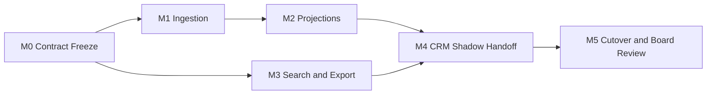

# Phase-2 Backend Thin-Slice Pilot Plan (SOU-32)

## Objective
Deliver a production-ready thin slice for SouthernIoT backend integration by April 17, 2026, covering ChirpStack/CRM ingestion, deterministic DPL search, and asynchronous field-pack export with clear cutover and rollback controls.

## Scope
- In scope:
  - `/v1/ingestion/events` contract-valid event intake and immutable persistence
  - `/v1/search/documents` deterministic metadata retrieval over generated index artifacts
  - `/v1/exports/field-pack` async export jobs and artifact status tracking
  - gateway + edge-node pilot flows across required lifecycle states
- Out of scope:
  - AI-generated procedural decisions in backend responses
  - taxonomy/state model changes outside repository governance
  - analytics/recommendation pipelines

## Milestones (Explicit Owners)
| Milestone | Dates (2026) | Owner | Dependencies | Exit Criteria |
| --- | --- | --- | --- | --- |
| M0: Contract Freeze and Baseline Validation | Mar 27 to Mar 29 | Backend (`backend-core`) + Schema/Tool Maintainers | [SOU-23](/SOU/issues/SOU-23) artifacts | `validate_library` + `validate_crm_contracts` clean; OpenAPI examples synchronized |
| M1: Ingestion + Idempotency Path | Mar 30 to Apr 2 | Backend (`backend-core`) | M0 | Canonical ingest ledger writes; duplicate `event_id` replay is no-op; deterministic error envelope on invalid payloads |
| M2: Lifecycle Projection Read Models | Apr 3 to Apr 6 | Backend (`backend-core`) | M1 | `device_lifecycle_state` + `gateway_lifecycle_state` projections serve CRM read-path needs |
| M3: Search and Export API Enablement | Apr 7 to Apr 10 | Backend (`backend-core`) + DevOps | M0, M1 | Search queries resolve to file metadata; export jobs return queue state + artifact checksum metadata |
| M4: CRM Integration Handoff + Pilot Shadow Run | Apr 11 to Apr 14 | Backend (`backend-core`) + CRM Integrations + CTO | M2, M3 | CRM consumes projection/search/export contracts in shadow mode with no customer-visible cutover |
| M5: Controlled Cutover + Board Readiness Review | Apr 15 to Apr 17 | CTO + Backend (`backend-core`) | M4 | Go/no-go review complete; rollback drill executed; pilot accepted for production rollout |

## Dependency Graph

## Infrastructure Prerequisites
- PostgreSQL 15+ with migration ownership and PITR-enabled backup policy.
- Durable queue for export jobs with dead-letter support (`export_jobs` retries and failure capture).
- Object storage bucket for field-pack artifacts with checksum retention.
- Observability baseline:
  - ingestion success/failure counters
  - projection lag and queue depth dashboards
  - contract-failure alerting routed per `integrations/crm/notification-routing.yaml`
- Secret/config management for CRM API credentials and ChirpStack tenant bindings.

## CRM/DPL Integration Handoff Points
- H1: Event ingestion handshake
  - CRM/ChirpStack payload producer sends `crm-event.schema.json` compliant payload.
  - Backend returns `202` acceptance or deterministic `error-envelope`.
- H2: State projection reads
  - CRM reads latest per-device/per-gateway projection state through backend read contracts.
  - Projection state remains derived from immutable ledger, never from manual CRM mutation.
- H3: Search retrieval integration
  - CRM assistant/search clients call `/v1/search/documents` with role/state/product filters.
  - Response includes only file paths and metadata (no generated instruction text).
- H4: Export fulfillment integration
  - CRM requests field pack export.
  - Backend returns job status and final artifact URI + checksum for operational audit.

## Cutover and Rollback Strategy
### Cutover Plan
1. Enable ingestion shadow writes while existing CRM path remains authoritative.
2. Compare projection parity for gateway and edge-node pilot projects.
3. Enable search API for pilot users with read-only access controls.
4. Shift export requests for pilot projects to backend queue.
5. Run board checkpoint with explicit go/no-go evidence.

### Rollback Triggers
- Ingestion contract error rate > 2% over 15 minutes.
- Projection lag > 10 minutes for pilot projects.
- Export queue backlog > 30 minutes for `high` priority pilot jobs.

### Rollback Actions
1. Route pilot CRM export requests back to manual tooling workflow.
2. Disable projection-backed CRM reads and return to legacy read path.
3. Keep ingestion ledger online for forensic replay; pause downstream projection workers.
4. File incident summary and corrective task list before reattempt.

## Risk Register
| Risk | Likelihood | Impact | Mitigation | Owner |
| --- | --- | --- | --- | --- |
| ChirpStack payload version drift | Medium | High | Validate `source.version`; maintain adapter tests by version profile | Backend |
| Event replay burst from webhook retries | High | Medium | strict `event_id` idempotency + dedupe metrics and alarms | Backend |
| Projection drift from mapping mismatch | Medium | High | parity checks against `integrations/crm/state-mapping.yaml` on deploy | Backend + CRM Integrations |
| Export artifact storage outage | Low | High | retry with DLQ fallback and manual export fallback path | DevOps + Backend |
| Incomplete CRM handoff before cutover | Medium | High | enforce H1-H4 sign-off checklist in M4 gate | CTO + CRM Integrations |

## Execution Log
- 2026-03-27: Created phase-2 thin-slice pilot plan with dated milestones, owners, dependency graph, and explicit handoff checkpoints.
- 2026-03-27: Added cutover thresholds and rollback actions for ingestion/projection/export failure scenarios.
- 2026-03-27: Linked pilot scope to existing schema/contract artifacts from [SOU-23](/SOU/issues/SOU-23).
